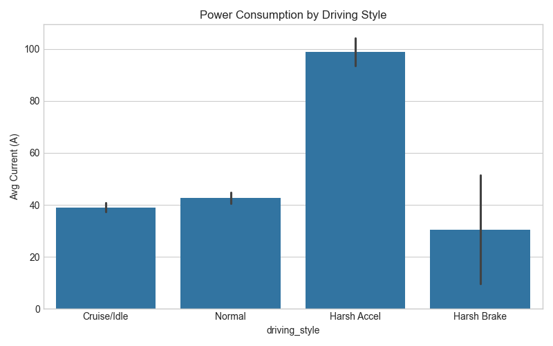
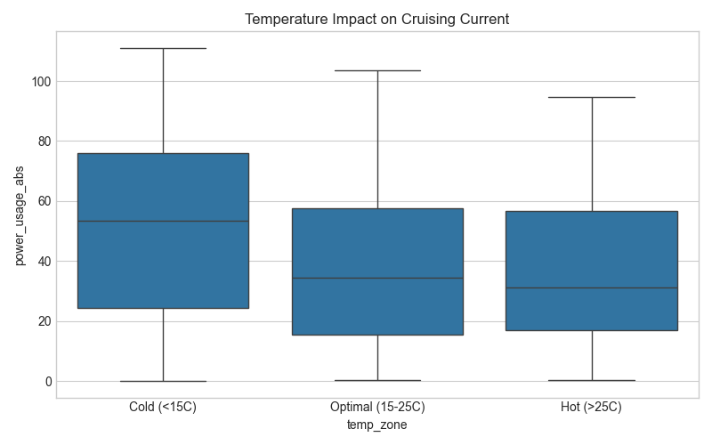
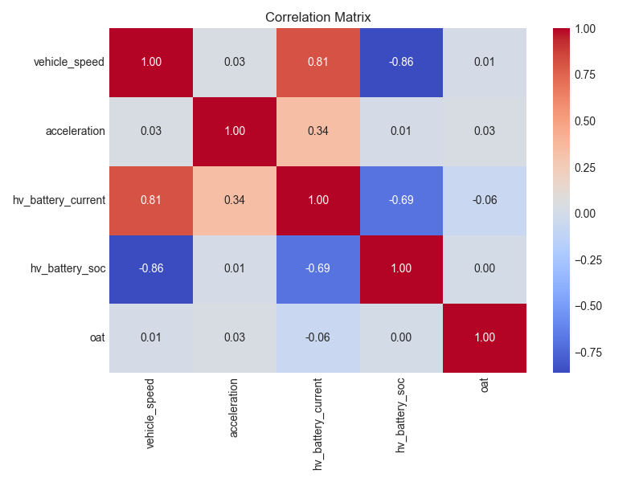

# EV Telemetry Data Analysis (Focus: Energy Management) ⚡🚗

This project analyzes Electric Vehicle (EV) telemetry data to identify patterns in energy consumption based on driving behavior and environmental factors. It is designed to demonstrate data processing, feature engineering, and analytical thinking applied to the automotive industry.

## 🎯 Objectives
- **Data Preprocessing & Cleaning**: Handle missing sensor values through interpolation and standardize telemetry columns.
- **Drivability Feature Engineering**: Calculate vehicle acceleration from speed profiles to categorize driving behavior (e.g., Harsh Acceleration, Harsh Braking, Cruising).
- **Energy Management Insights**: Evaluate how external factors (Outside Air Temperature) and driver habits influence the battery's current discharge rate.

## 📊 Key Insights & Visualizations

### 1. Drivability and Power Consumption
By computing the derivative of speed over time, we classify driving habits. As expected, **Harsh Acceleration** draws significantly more current from the battery compared to normal cruising, heavily impacting the State of Charge (SOC) range.

### 2. Thermal Impact on Battery Performance
Electric vehicle batteries are highly sensitive to extreme temperatures. In this analysis, we isolate the vehicle's cruising state to observe purely environmental effects. Data shows that in **Cold temperatures (<15°C)**, the internal resistance increases, requiring a higher discharge current to maintain the same speed.

### 3. Feature Correlation 
A correlation matrix reveals strong inverse relationships between vehicle speed/acceleration and the battery SOC over time, while current spikes strongly correlate with harsh acceleration events.

## 🛠️ Tech Stack
- **Python**: Pandas, NumPy
- **Data Visualization**: Matplotlib, Seaborn
- **Environment**: Jupyter Notebook

## 🚀 How to Run
1. Clone this repository.
2. Ensure you have `pandas`, `numpy`, `matplotlib`, and `seaborn` installed.
3. Open `ev_analysis.ipynb` in Jupyter Notebook or VS Code.
4. Run all cells to reproduce the analysis and charts using `dataset.csv`.

---
*Created by [Tran Thi Khanh Huyen]*
